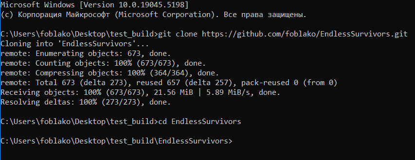
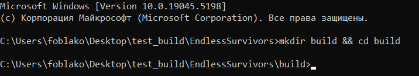
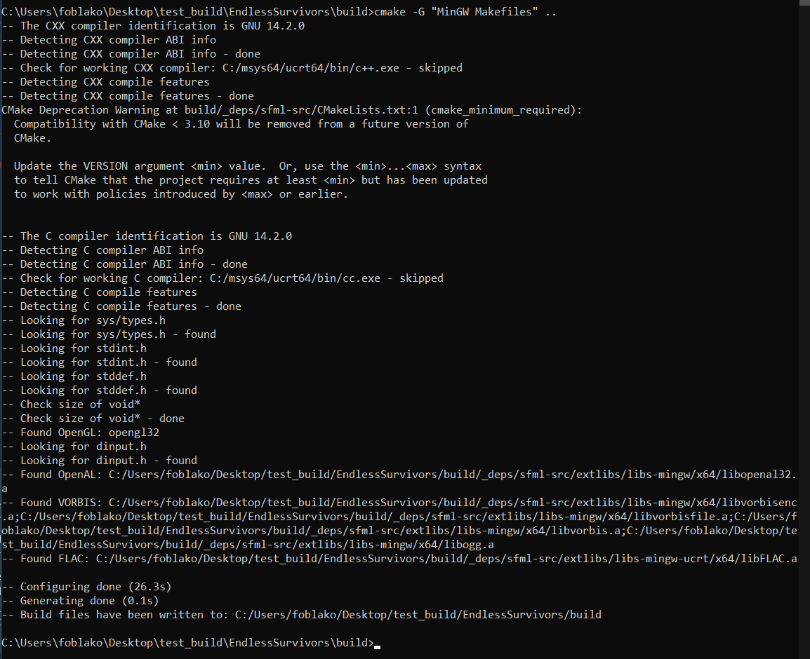
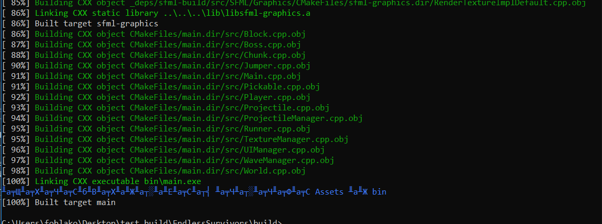

# Описание

Игра Endless Survival представляет собой бесконечную 2д survival игру с видом
сверху. В ней вам предстоит сразиться с тысячами монстров, продержаться как
можно дольше. Усильте своего персонажа, чтобы выдержать новые, более
сложные волны врагов. Найдите Звезду Эдема в бесконечном мире, чтобы
навсегда искоренить зло

# Игровой процесс

Игрок исследует открытый мир, взаимодействует с объектами и сражается с врагами, такими как Бегун, Прыгун и Босс. Для борьбы улучшайте свое оружие, чтобы одолеть любого врага.

# Цель Игры

Главная цель игры — Найти звезду Эдема.

# Видео геймплея

[Смотреть видео геймплея](https://drive.google.com/file/d/1C4JgXZqDNDg44YZvI_N_0jWcBCTyWuN9/view?usp=sharing)


# Требования

- **CMake** (версия 3.28 или выше)
- **MinGW** (для сборки с использованием MinGW Makefiles)
- **Git** (для клонирования репозитория)


# Шаги по установке и сборке

1. **Установите Git:**

   Скачайте и установите Git с [официального сайта](https://git-scm.com/download/win).

2. **Установите MinGW:**

   Скачайте и установите MinGW с [официального сайта](https://sourceforge.net/projects/mingw/). Во время установки выберите следующие компоненты:
   - `mingw32-gcc-g++`
   - `mingw32-base`
   - `msys-base`

   Добавьте `C:\MinGW\bin` в переменную окружения `PATH`.

3. **Установите CMake:**

   Скачайте и установите CMake с [официального сайта](https://cmake.org/download/). Во время установки выберите опцию "Add CMake to the system PATH for all users".


4. **Склонируйте репозиторий проекта:**

   ```sh
   git clone https://github.com/foblako/EndlessSurvivors.git
   ```


5. **Перейдите в директорию проекта:**

   ```sh
   cd EndlessSurvivors
   ```

6. **Создайте директорию сборки и перейдите в неё:**

   ```sh
   mkdir build && cd build
   ```


7. **Запустите CMake для генерации файлов сборки:**

   ```sh
   cmake -G "MinGW Makefiles" ..
   ```

   

8. **Соберите проект с помощью Make:**

   ```sh
   mingw32-make
   ```

   

9. **Запустите игру:**

   ```sh
   cd bin && main.exe
   ```